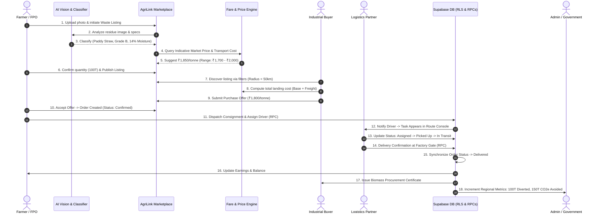

# AgriLink: Product Requirements Document (PRD)
**Smart India Hackathon (SIH Problem Statement: SIH26033)**  
**Ecosystem**: Agricultural Waste Valorization, Direct Marketplace, Dynamic Fare Engine & AI Logistics  
**Document Version**: 2.0.0  
**Status**: Comprehensive Planning & Architecture Baseline  
**Target Date / Local Context**: September 2026  

---

## 1. Executive Summary & Product Vision

### 1.1 Problem Context
Every harvest season, millions of tonnes of agricultural crop residue (paddy straw, wheat stubble, sugarcane bagasse, cotton stalks, mustard husk, coconut coir, and corn stover) are burnt in open fields across India. This seasonal open-field burning triggers severe air pollution (severe spikes in PM2.5, PM10, CO2, CO, and NOx), causes irreversible degradation of topsoil microbial health, and discards billions of rupees worth of bio-energy and raw material potential. 

Simultaneously, manufacturing industries—including bio-pellet/briquette manufacturers, 2G ethanol plants, bio-CNG facilities (SATAT initiative), paper mills, packaging industries, mushroom cultivation units, and biochar producers—struggle with unreliable supply chains, unpredictable biomass pricing, and fragmented rural transport logistics.

### 1.2 AgriLink Solution
**AgriLink** is an integrated, full-stack digital ecosystem and direct marketplace designed to transform agricultural crop residue from an environmental liability into a lucrative economic asset for farmers. 

AgriLink unites five core stakeholders:
1. **Farmers / Farmer Producer Organisations (FPOs) / Waste Suppliers**: Monetise agricultural residue, access fair market pricing, and avoid burning fines.
2. **Industrial Buyers / Bulk Processors / Institutional Off-takers**: Source verified agricultural biomass with transparent specifications (moisture, calorific value, packaging format).
3. **Logistics & Delivery Fleet Partners**: Discover consolidated rural pickup routes, eliminate empty return trips, and execute multi-stop farm-to-factory transport.
4. **Government & Environmental Regulators**: Track residue diversion volumes in real time, monitor district-level burn risks, verify carbon offsets, and audit compliance.
5. **Community & Rural Stakeholders**: Exchange agricultural residue valorisation techniques, best practices, and local equipment-sharing arrangements.

---

## 2. Existing Codebase Baseline & Audit

An exhaustive technical audit of the current AgriLink repository reveals a high-quality, production-ready foundation developed across Phases 1 through 5, primarily configured around direct produce trade and now ready for complete valorisation into agricultural residue:

| Architecture Layer | Current Implementation Status | Existing Repository Assets |
| :--- | :--- | :--- |
| **Frontend Framework** | Next.js 14+ (App Router, Turbopack/Webpack, React 18+, TypeScript) | `src/app/`, `src/components/`, `src/lib/` |
| **Styling & UI Shell** | Tailwind CSS with custom agricultural theme (`agri-evergreen`, `agri-sprout`, `agri-harvest`, `agri-earth`) | `tailwind.config.ts`, `src/app/globals.css`, `src/components/ui/` |
| **Authentication & RBAC** | Supabase Auth (`@supabase/ssr`), role-based routing middleware, client route guards, 5 application roles | `src/middleware.ts`, `src/context/AuthContext.tsx`, `src/lib/auth/rbac.ts`, `src/components/auth/RouteGuard.tsx` |
| **Database & Security** | PostgreSQL on Supabase with Row Level Security (RLS) policies, atomic functions, database triggers | `supabase/migrations/20260907000000_*` through `20260908000004_*` |
| **Marketplace Engine** | Direct listing creation, image upload to Supabase Storage, search, category filter, atomic ordering with `FOR UPDATE` stock locking | `src/lib/services/listings.ts`, `src/components/listings/CreateListingModal.tsx`, `ProduceDetailModal.tsx` |
| **Logistics & Tracking** | Order confirmation, dispatch assignment RPC, 4-stage tracking (`assigned` → `picked_up` → `in_transit` → `delivered`), deterministic route stop sequencing | `src/lib/services/delivery.ts`, `src/app/(app)/delivery/page.tsx`, `src/app/(app)/orders/page.tsx` |
| **Testing** | Automated End-to-End (E2E) test suite in Playwright verifying order lifecycle and strict RLS permissions | `e2e/phase-b-logistics.spec.ts`, `e2e/phase-b-security.spec.ts` |

---

## 3. Stakeholder Personas & RBAC Matrix

The system preserves five dedicated stakeholder personas with granular access control:

```
+----------------------------------------------------------------------------------------------------+
|                                    AGRILINK PLATFORM USERS                                         |
+---------------------+---------------------+--------------------+-------------------+---------------+
|   Farmer / FPO      |  Industrial Buyer   |  Delivery Partner  |  Platform Admin   |   Consumer /  |
|  (Waste Supplier)   |    (Off-taker)      |    (Logistics)     |   & Government    |  Public User  |
+---------------------+---------------------+--------------------+-------------------+---------------+
| • List waste batches| • Post bulk RFQs    | • Accept routes    | • District audits | • Browse open |
| • AI classification | • Make offers       | • Update waypoints | • Impact metrics  |   marketplace |
| • Confirm dispatch  | • Track consignments| • Confirm delivery | • Resolve disputes| • View impact |
| • View earnings     | • Log emissions save| • View payout logs | • Manage subsidies| • Community   |
+---------------------+---------------------+--------------------+-------------------+---------------+
```

### 3.1 Role Permissions Matrix

| Route / Module | `farmer_fpo` | `bulk_buyer` | `delivery_partner` | `admin` | `consumer` |
| :--- | :---: | :---: | :---: | :---: | :---: |
| `/marketplace` (Browse & Search) | Read / Write (Own) | Read / Bid | Read | Full Access | Read |
| `/farmer` (Supplier Console) | Full Access | Denied | Denied | Full Access | Denied |
| `/bulk-buyer` (Industry Procurement) | Denied | Full Access | Denied | Full Access | Denied |
| `/delivery` (Fleet Dispatch & Route) | Denied | Denied | Full Access | Full Access | Denied |
| `/admin` (Government & Regulator) | Denied | Denied | Denied | Full Access | Denied |
| `/orders` (Lifecycle & Tracking) | Own Listings | Own Purchases | Assigned Tasks | All Platform | Own Orders |
| `/community` (Community Knowledge Hub)| Read / Post | Read / Post | Read | Moderate | Read / Post |
| `/profile` (Profile & Verification) | Own Profile | Own Profile | Own Profile | Full Access | Own Profile |

---

## 4. The Golden Demo Workflow (End-to-End)

The "Golden Demo" is the definitive end-to-end user journey that demonstrates AgriLink's complete architectural integrity for the SIH evaluation:



---

## 5. Detailed Feature Specifications

### Priority Classification Standard
- **P0**: Mandatory for SIH MVP and Live Demo (Must be operational end-to-end).
- **P1**: Important Enhancement (Required for production pilot).
- **P2**: Future Architectural Scope (Planned 3-6 months post-MVP).
- **P3**: Long-term Strategic Scope (Advanced integrations, Enterprise features).

---

### MODULE 1: CORE PLATFORM & ACCESS CONTROL

#### Feature 1.1: Responsive Application Shell & Role-Based Navigation
- **Purpose**: Provide clean, unified navigation dynamically tailored to the authenticated user's role while preventing unauthorized route access.
- **Target User**: All 5 ecosystem roles.
- **User Story**: As an authenticated user, I want the navigation bar and sidebar to display only the tools and dashboards relevant to my operational role so that my workflow remains focused and secure.
- **Functional Requirements**:
  1. Detect authenticated user role via `AuthContext`.
  2. Filter `ALL_NAV_ITEMS` using `ROLE_NAV_ITEMS[role]`.
  3. Enforce route boundaries using `RouteGuard.tsx` and Next.js middleware.
  4. Display user identity, role badge, and fast sign-out controls.
- **Inputs**: User session token, Supabase `profiles.role`.
- **Outputs**: Filtered sidebar, header, active route view.
- **Data Required**: `profiles (id, full_name, email, role)`.
- **Existing Implementation Status**: Fully implemented in `src/lib/auth/rbac.ts`, `src/components/layout/AppSidebar.tsx`, `AppHeader.tsx`, `RouteGuard.tsx`.
- **Dependencies**: Supabase Auth, `@supabase/ssr`.
- **Priority**: **P0** (Existing Core).
- **Acceptance Criteria**: Unauthorized route access (e.g., consumer navigating to `/admin`) immediately renders an `Access Restricted` card with redirect to the user's role home.

#### Feature 1.2: Unified Authentication & Role Selection
- **Purpose**: Allow new participants to register directly under a defined agricultural role with validated metadata.
- **Target User**: Farmers, Industrial Buyers, Delivery Partners, Consumers.
- **User Story**: As a new platform user, I want to sign up with my email, name, and operational role so that the system immediately grants me appropriate permissions.
- **Functional Requirements**:
  1. Render interactive 5-role picker card grid in `RegisterForm.tsx`.
  2. Insert user into `auth.users` with metadata (`full_name`, `role`).
  3. Execute PostgreSQL trigger `handle_new_user()` to populate `public.profiles`.
- **Inputs**: Full name, email, password, selected role.
- **Outputs**: Session cookie, user profile record.
- **Data Required**: `auth.users`, `public.profiles`.
- **Existing Implementation Status**: Fully implemented in `src/components/auth/RegisterForm.tsx`, `LoginForm.tsx`, Supabase trigger in `20260907000000_phase3_backend_foundation.sql`.
- **Dependencies**: Supabase Auth.
- **Priority**: **P0** (Existing Core).
- **Acceptance Criteria**: New registration automatically creates profile row matching chosen role without manual database intervention.

#### Feature 1.3: Stakeholder Profile & FPO Facility Management
- **Purpose**: Allow producers and businesses to manage operational details, contact information, and farm/FPO credentials.
- **Target User**: Farmers, FPOs, Industrial Buyers.
- **User Story**: As a farmer or FPO lead, I want to record my farm name, district, state, and FPO registration status so that buyers know my geographic location and legal standing.
- **Functional Requirements**:
  1. Profile view and edit form for personal details.
  2. Dedicated Farm/FPO card allowing upsert of `organization_name`, `district`, `state`, and `is_fpo`.
  3. Enforce RLS: users can only modify their own profile and farm records.
- **Inputs**: Full name, phone number, organisation name, district, state, FPO boolean.
- **Outputs**: Updated database records, live confirmation banner.
- **Data Required**: `profiles`, `farms_fpos`.
- **Existing Implementation Status**: Fully implemented in `src/app/(app)/profile/page.tsx` and `src/lib/services/profile.ts`.
- **Dependencies**: Supabase client.
- **Priority**: **P0** (Existing Core).
- **Acceptance Criteria**: Saving farm information updates the database and reflects immediately across subsequent listings and dispatch origin lookups.

---

### MODULE 2: AGRICULTURAL WASTE MARKETPLACE

#### Feature 2.1: Agricultural Waste Listing Creation
- **Purpose**: Enable farmers and FPOs to list available agricultural crop residue batches for industrial procurement.
- **Target User**: Farmers, FPOs, Waste Suppliers.
- **User Story**: As a farmer with post-harvest paddy straw, I want to list 50 tonnes of baled residue with moisture details and price per tonne so that nearby industrial buyers can purchase it.
- **Functional Requirements**:
  1. Input form capturing:
     - Waste Category: Paddy Straw, Sugarcane Bagasse, Wheat Straw, Cotton Stalk, Mustard Husk, Coconut Shell/Coir, Corn Stover.
     - Quantity (Tonnes) and Minimum Order Quantity (MOQ).
     - Moisture Content percentage (<15%, 15-20%, >20%).
     - Form/Packaging: Loose Biomass, Round Bales, Square Bales, Shredded, Briquettes.
     - Selling Price per Tonne (INR).
     - Mandi / Govt Benchmark Price.
     - Collection Location (Village/Mandal/District/State).
     - Storage Condition: Covered Shed, Open Field, Tarpaulin Covered.
  2. Upload batch photographs to `produce-images` bucket.
  3. Store listing with `is_active = true`.
- **Inputs**: Category, title, description, quantity (tonnes), moisture, packaging, unit price, photos.
- **Outputs**: New listing record, public marketplace card.
- **Data Required**: `produce_listings` (extended with waste attributes).
- **Existing Implementation Status**: Partially implemented. Current system supports produce listings (`title`, `category`, `price_per_kg`, `available_quantity_kg`, `mandi_benchmark_price`, `image_url`). Needs schema expansion for waste-specific fields (tonnes, moisture %, bale format).
- **Dependencies**: Supabase Storage, `produce_listings` table.
- **Priority**: **P0** (Mandatory MVP).
- **Acceptance Criteria**: Farmer can successfully create a waste listing with quantity and price; listing appears instantaneously in `/marketplace`.

#### Feature 2.2: Marketplace Discovery, Search & Multi-Parametric Filtering
- **Purpose**: Enable buyers and aggregators to discover relevant biomass supplies based on residue type, distance, quantity, and price.
- **Target User**: Industrial Buyers, Bulk Aggregators, Delivery Partners.
- **User Story**: As a bio-pellet plant manager, I want to search for Paddy Straw within 50 km having moisture under 15% so that I can maintain raw material specifications.
- **Functional Requirements**:
  1. Category navigation tabs (Paddy Straw, Bagasse, Cotton Stalks, etc.).
  2. Real-time text search covering title, description, district, and farmer organisation.
  3. Filter controls for:
     - Maximum price per tonne.
     - Packaging format (Baled vs Loose).
     - Geographic District / State.
  4. Visual indicators for Mandi benchmark savings and FPO verification.
- **Inputs**: Category selection, search query string, filter parameters.
- **Outputs**: Filtered array of listing cards.
- **Data Required**: `produce_listings` joined with `profiles` and `farms_fpos`.
- **Existing Implementation Status**: Implemented for produce in `src/app/(app)/marketplace/page.tsx` with search, category filtering, and client-side price filter.
- **Dependencies**: Database index on category and search columns.
- **Priority**: **P0** (Mandatory MVP).
- **Acceptance Criteria**: Searching "Paddy" filters the grid in real-time (<200ms) and displays verified supplier badges.

#### Feature 2.3: Atomic Purchase & Inventory Reservation
- **Purpose**: Prevent race conditions, double-selling, and price tampering during bulk ordering.
- **Target User**: Industrial Buyers, Bulk Buyers.
- **User Story**: As an industrial buyer, I want to place a direct order for 20 tonnes of crop residue with atomic guarantee that the inventory is deducted and price cannot be altered in transit.
- **Functional Requirements**:
  1. Buyer opens detail modal, enters order quantity.
  2. System invokes PostgreSQL RPC `place_direct_order`.
  3. Database acquires row-level exclusive lock (`FOR UPDATE`) on listing.
  4. System verifies stock, derives unit price from database, computes `total_price`.
  5. Stock is atomically decremented; new order is recorded with status `pending`.
- **Inputs**: `listing_id`, `quantity_tonnes`.
- **Outputs**: Order confirmation, generated `order_id`, remaining available stock.
- **Data Required**: `orders`, `produce_listings`.
- **Existing Implementation Status**: Fully implemented in `20260907000002_phase4_atomic_orders_and_stock.sql` and `src/components/listings/ProduceDetailModal.tsx`.
- **Dependencies**: PostgreSQL RPC `place_direct_order`.
- **Priority**: **P0** (Existing Core).
- **Acceptance Criteria**: Concurrent orders for remaining stock fail gracefully with an informative out-of-stock message, preventing negative balances.

#### Feature 2.4: Buyer Industrial Requirement Postings (Reverse RFQ)
- **Purpose**: Allow industrial plants to broadcast their continuous biomass intake requirements so farmers and FPOs can fulfil them directly.
- **Target User**: Industrial Buyers, Biomass Plants, FPOs.
- **User Story**: As a 2G ethanol refinery procurement officer, I want to post a seasonal requirement for 5,000 tonnes of dry bagasse at ₹2,100/tonne delivered so that regional FPOs can aggregate and supply.
- **Functional Requirements**:
  1. Form to create Industrial Requirement (Residue Type, Monthly Volume, Delivery Window, Target Price, Delivery Location).
  2. Public requirement board for FPOs.
  3. FPO response mechanism ("Apply to Supply").
- **Inputs**: Buyer requirement specifications.
- **Outputs**: Active RFQ posting, supplier bid list.
- **Data Required**: `buyer_requirements` table (proposed).
- **Existing Implementation Status**: UI Shell exists in `src/app/(app)/bulk-buyer/page.tsx`; database schema and interactive RFQ workflows to be added.
- **Dependencies**: Supabase table `buyer_requirements`.
- **Priority**: **P1** (Important Enhancement).
- **Acceptance Criteria**: FPO can view open buyer procurement demand and submit an offer against the requirement.

#### Feature 2.5: Offer Negotiation & Counter-Offer Workflow
- **Purpose**: Enable price discovery and commercial flexibility between farmers and bulk off-takers before binding order creation.
- **Target User**: Farmers, Industrial Buyers.
- **User Story**: As an industrial buyer, I want to propose ₹1,750/tonne for a 100-tonne listing priced at ₹1,900/tonne so that we can negotiate bulk delivery terms.
- **Functional Requirements**:
  1. "Make Offer" button on listing modal.
  2. Farmer receives offer notification on console.
  3. Farmer options: "Accept Offer", "Decline", or "Counter-Offer".
  4. Upon mutual acceptance, atomic order is generated at agreed price.
- **Inputs**: Proposed unit price, proposed quantity, pickup terms.
- **Outputs**: Offer status (`pending`, `accepted`, `rejected`, `countered`).
- **Data Required**: `marketplace_offers` table (proposed).
- **Existing Implementation Status**: Previously planned; currently orders go directly to `pending` status.
- **Dependencies**: Messaging/notification system.
- **Priority**: **P1** (Important Enhancement for SIH).
- **Acceptance Criteria**: Accepted offer automatically creates an order with the negotiated price rather than the listing catalogue price.

---

### MODULE 3: AI INTELLIGENCE ENGINE

```
+----------------------------------------------------------------------------------------------------+
|                                    AGRILINK AI SUBSYSTEMS                                          |
+-----------------------------------+--------------------------------+-------------------------------+
|  1. Vision Residue Classifier     |  2. Auto-Fill Listing Assistant|  3. Buyer-Supplier Matcher    |
+-----------------------------------+--------------------------------+-------------------------------+
| • Input: Mobile photo of residue  | • Extracts type, predicts      | • Geo-spatial proximity       |
| • Model: Pretrained lightweight   |   moisture, suggests pricing   | • Volume & intake matching    |
|   vision model / Gemini API       | • Pre-populates title & tags   | • Generates supplier alerts   |
| • Output: Crop type & grade       | • MVP: Form helper             | • Future: Graph neural network|
+-----------------------------------+--------------------------------+-------------------------------+
```

#### Feature 3.1: AI-Assisted Agricultural Waste Classification (MVP vs Future)
- **Purpose**: Automatically identify the type of crop residue and estimate physical characteristics from smartphone camera imagery.
- **Target User**: Farmers, Field Aggregators.
- **User Story**: As a rural farmer listing crop waste, I want to take a picture of my residue piles and have the system auto-detect that it is Paddy Straw so that I don't have to navigate complex categorization forms.
- **Functional Requirements**:
  - **MVP (P0)**:
    1. Upload residue image in listing modal.
    2. Client or edge API evaluates image using Gemini Multimodal API or lightweight image classifier.
    3. Return predicted residue category (`paddy_straw`, `sugarcane_bagasse`, `cotton_stalk`, `wheat_straw`) with confidence score.
    4. Auto-select category in dropdown and prompt confirmation.
  - **Future Scope (P2)**:
    1. On-device edge inference using TensorFlow Lite / ONNX Web Runtime for zero-bandwidth rural operation.
    2. Moisture estimation via optical texture analysis and ambient humidity correlation.
- **Inputs**: Image file (JPEG/PNG/WebP, max 5MB).
- **Outputs**: Residue class, confidence score, detected quality traits.
- **Data Required**: Pretrained classification weights or API endpoint.
- **Existing Implementation Status**: Image upload exists (`produce-images` bucket). Classification pipeline is designed but pending API hookup.
- **Dependencies**: Image upload component, Gemini API key or inference endpoint.
- **Priority**: **P0** (MVP rule-based / API integration), **P2** (Custom on-device edge model).
- **Acceptance Criteria**: Uploading a photo of straw automatically selects "Paddy Straw" with >80% confidence or defaults to manual confirmation if ambiguous.

#### Feature 3.2: AI-Assisted Listing Creation & Auto-Fill
- **Purpose**: Minimise cognitive load and form-filling friction for rural farmers.
- **Target User**: Farmers, FPO staff.
- **User Story**: As an FPO manager, I want the system to generate an optimized listing title, description, and recommended price range based on crop type and harvest date.
- **Functional Requirements**:
  1. Once residue type and estimated quantity are entered, invoke auto-fill assistant.
  2. Synthesise descriptive title (e.g., "Export-Quality Dry Paddy Straw Bales - Kolar Cluster").
  3. Populate batch description highlighting potential industrial use-cases (e.g., "Ideal for Biomass Briquettes, Ethanol Production, or Mushroom Cultivation").
  4. Pre-fill optimal benchmark price from dynamic pricing engine.
- **Inputs**: Residue type, quantity, location.
- **Outputs**: Auto-completed title, description, recommended price.
- **Data Required**: Waste taxonomy database, industrial use-case mapping.
- **Existing Implementation Status**: Planned architecture.
- **Dependencies**: LLM prompt utility / template rules.
- **Priority**: **P1** (Enhancement).
- **Acceptance Criteria**: Clicking "AI Assist" fills title and description with realistic, contextual information in under 2 seconds.

#### Feature 3.3: AI-Assisted Buyer-Supplier Matching Engine
- **Purpose**: Connect industrial buyers with regional suppliers to minimise transit times and aggregate smallholder farm supplies.
- **Target User**: Industrial Procurement Managers, FPOs.
- **User Story**: As a factory buyer requiring 500 tonnes of biomass, I want the system to automatically suggest an aggregated cluster of 5 nearby farmers who collectively meet my quantity within a 25 km radius.
- **Functional Requirements**:
  - **MVP (P1)**: Distance-based algorithmic grouping querying Supabase PostGIS or Euclidean district proximity.
  - **Future (P2)**: Dynamic linear programming optimizer minimizing freight cost while fulfilling buyer moisture constraints.
- **Inputs**: Buyer location, residue requirement, target delivery date.
- **Outputs**: Ranked list of matching farm listings or aggregated supplier clusters.
- **Data Required**: Listing coordinates/district, buyer factory coordinates.
- **Existing Implementation Status**: Basic district filtering exists; algorithmic clustering is planned.
- **Dependencies**: Geocoding or district coordinate mapping.
- **Priority**: **P1** (MVP proximity matching), **P2** (Advanced cluster optimization).
- **Acceptance Criteria**: System suggests at least 3 nearby suppliers whose aggregated volume matches the buyer's requirement.

---

### MODULE 4: AGRILINK FARE & DYNAMIC PRICE ENGINE

#### 4.1 Architectural Philosophy: No Pseudo-Science
The AgriLink Fare & Dynamic Price Engine avoids arbitrary formulas. It uses a **multi-component transparent pricing model** grounded in real-world agricultural economics and freight logistics:

$$\text{Final Delivered Price} = \text{Farm Gate Price} + \text{Packaging/Baling Factor} + \text{Quality/Moisture Adjustment} + \text{Logistics Freight Fee}$$

```
+---------------------------------------------------------------------------------------------------+
|                                  AGRILINK FARE ENGINE ARCHITECTURE                                |
+-------------------------------+----------------------------------+--------------------------------+
|  1. Indicative Market Price   |  2. Quality & Moisture Index     |  3. Freight Logistics Component|
+-------------------------------+----------------------------------+--------------------------------+
| • Based on regional Mandi &   | • Base moisture benchmark (15%)  | • Base loading charge (₹350/T) |
|   State Bio-Energy indices    | • Premium for baled vs loose     | • Distance rate: ₹4.5/T/km     |
| • Seasonal burning index      | • Quality discount for high damp | • Return-trip empty mitigation |
+-------------------------------+----------------------------------+--------------------------------+
                                                │
                                                ▼
                         Delivered Buyer Price = Base + Quality + Freight
```

#### 4.2 Price Distinctions & Specifications
The platform strictly distinguishes five financial components:

1. **Indicative Market Price ($P_{\text{market}}$)**:
   - Regional reference price established by State Bio-Energy Development Agencies (e.g., PEDA, HAREDA), central minimum biomass benchmarks (CERC/MNRE), or prevailing APMC Mandi rates for fodder/straw.
2. **Recommended Seller Price ($P_{\text{seller}}$)**:
   - Price suggested to the farmer, calculated as:
     $$P_{\text{seller}} = P_{\text{market}} \times (1 + \text{Baling Premium} - \text{Moisture Penalty})$$
3. **Buyer Offer Price ($P_{\text{buyer}}$)**:
   - The commercial bid submitted by an industrial buyer during negotiation.
4. **Logistics & Freight Component ($F_{\text{freight}}$)**:
   - Transparent transport cost computed as:
     $$F_{\text{freight}} = \text{Fixed Loading/Handling Fee} + (\text{Distance in km} \times \text{Per-Tonne-Km Rate})$$
5. **Final Negotiated Transaction Price ($P_{\text{final}}$)**:
   - The binding contract value agreed upon acceptance of an order or counter-offer.

#### 4.3 MVP Rule-Based Engine vs. Future ML-Driven Engine
- **MVP Implementation (P0)**:
  - Table-driven regional base rates per crop type (e.g., Paddy Straw: ₹1,800/T; Bagasse: ₹2,200/T; Mustard Husk: ₹2,400/T).
  - Explicit adjustment factors:
    - Baled format: +₹250/T (covers baling twine and machinery depreciation).
    - Loose format: -₹150/T (higher transport volume penalty).
    - Moisture > 20%: -10% deduction (additional drying requirement).
  - Freight estimation: Flat ₹400 base loading + ₹5.00 per tonne per km.
- **Future ML Approach (P2)**:
  - Supervised regression model trained on historical AgriLink transaction records, spot coal price parity, crude oil prices, rainfall indices, and seasonal crop harvesting schedules across northern/western agricultural belts.

---

### MODULE 5: SMART AGRICULTURAL LOGISTICS & ROUTING

#### Feature 5.1: Order Dispatch & Fleet Partner Assignment
- **Purpose**: Transition confirmed orders into operational logistics tasks with designated pickup and drop-off waypoints.
- **Target User**: Farmers, FPOs, Platform Administrators.
- **User Story**: As a farmer with a confirmed 15-tonne order, I want to dispatch the batch and assign a local delivery partner so that transport is scheduled.
- **Functional Requirements**:
  1. Actionable "Dispatch Order" button visible only on `confirmed` orders.
  2. Modal opens with:
     - Delivery partner dropdown populated via `get_available_delivery_partners` RPC.
     - Origin pickup location (pre-filled from farm profile).
     - Delivery destination (pre-filled from buyer profile).
  3. Submitting triggers `dispatch_and_assign_delivery_job` RPC:
     - Validates caller is listing owner or admin.
     - Inserts record into `public.delivery_tasks` with status `assigned`.
     - Atomically transitions order status to `dispatched`.
- **Inputs**: `order_id`, `driver_id`, `pickup_location`, `delivery_location`.
- **Outputs**: Created `delivery_task` record, updated order status.
- **Data Required**: `orders`, `delivery_tasks`, `profiles`.
- **Existing Implementation Status**: Fully implemented in `supabase/migrations/20260908000004_phase5_logistics_and_tracking.sql`, `src/lib/services/delivery.ts`, and `src/app/(app)/orders/page.tsx`.
- **Dependencies**: PostgreSQL RPC `dispatch_and_assign_delivery_job`.
- **Priority**: **P0** (Existing Core).
- **Acceptance Criteria**: Only the producer owning the listing can dispatch; unauthorized callers receive permission denied.

#### Feature 5.2: Delivery Partner Route Console & Status Progression
- **Purpose**: Enable logistics drivers to view assigned consignments, follow optimized stops, and report delivery milestones.
- **Target User**: Delivery Fleet Partners, Truck Operators.
- **User Story**: As a rural truck driver, I want to see my pickup point, update my status when loaded, and confirm delivery at the industrial gate with a single tap.
- **Functional Requirements**:
  1. Driver navigates to `/delivery` and inspects assigned jobs.
  2. Status progression follows strictly enforced lifecycle:
     $$\text{Assigned} \xrightarrow{\text{Mark Picked Up}} \text{Picked Up} \xrightarrow{\text{Out for Delivery}} \text{In Transit} \xrightarrow{\text{Mark Delivered}} \text{Delivered}$$
  3. Each transition calls `update_delivery_status` RPC.
  4. When status reaches `delivered`, parent order status automatically synchronizes to `delivered`.
- **Inputs**: `task_id`, target `status`.
- **Outputs**: Real-time status update, synced order record.
- **Data Required**: `delivery_tasks`, `orders`.
- **Existing Implementation Status**: Fully implemented in `src/app/(app)/delivery/page.tsx` and tested in Playwright E2E.
- **Dependencies**: PostgreSQL RPC `update_delivery_status`.
- **Priority**: **P0** (Existing Core).
- **Acceptance Criteria**: Driver advancing to "Delivered" instantly updates both `delivery_tasks` and `orders` tables in a single database transaction.

#### Feature 5.3: Deterministic Route Stop Sequencing
- **Purpose**: Structure multiple pickups and drops into an efficient sequential itinerary to minimize empty mileage.
- **Target User**: Delivery Drivers, Fleet Managers.
- **User Story**: As a delivery driver handling multiple farm collections, I want an ordered list of waypoints (Pickups → Regional Hub → Factory Drop) with ETAs so that my journey is structured.
- **Functional Requirements**:
  1. Ingest active driver delivery tasks.
  2. Group pickups by origin collection centers.
  3. Insert regional consolidation hub waypoint for weight/quality checks.
  4. Sequence final factory delivery drops with estimated transit durations.
- **Inputs**: Array of `DeliveryTaskRow`.
- **Outputs**: Sequential `RouteStop[]` timeline (1 to N).
- **Data Required**: Task locations, contact phone numbers.
- **Existing Implementation Status**: Fully implemented via `buildDeterministicRouteStops()` in `src/lib/services/delivery.ts` and rendered in `/delivery`.
- **Dependencies**: None (pure deterministic algorithm).
- **Priority**: **P0** (Existing Core).
- **Acceptance Criteria**: Route Console displays sequential stops (Pickup #1, Hub Consolidation, Factory Drop) with dynamic ETA badges.

#### Feature 5.4: Live Consumer & Farmer Fulfillment Tracking
- **Purpose**: Allow both buyers and farmers to monitor consignment transit in real time.
- **Target User**: Farmers, Industrial Buyers.
- **User Story**: As a buyer, I want to track my ordered biomass consignment and see courier contact details so that my factory receiving crew is ready.
- **Functional Requirements**:
  1. Accessible via "Track Delivery" on `/orders` for dispatched/delivered orders.
  2. 4-Stage visual journey: Order Placed → Confirmed by Producer → Out for Delivery → Delivered.
  3. Waypoint display with origin, destination, courier name, and phone.
- **Inputs**: `order_id`.
- **Outputs**: Modal displaying live fulfillment progress.
- **Data Required**: `delivery_tasks` joined with driver `profiles`.
- **Existing Implementation Status**: Fully implemented in `src/app/(app)/orders/page.tsx` (`fetchDeliveryTrackingForOrder`).
- **Dependencies**: RLS policy allowing buyers and farmers to read assigned delivery tasks.
- **Priority**: **P0** (Existing Core).
- **Acceptance Criteria**: Modal opens with active stage highlighted; courier contact details appear once assigned.

#### Feature 5.5: Future Multi-Hop Route Optimization Integration
- **Purpose**: Integrate real-time routing engines (e.g., OSRM, Google Maps Routes API) for multi-truck fleet dispatch.
- **Target User**: Fleet Dispatchers, Large Logistic Aggregators.
- **Functional Requirements**:
  1. Transition from deterministic heuristic to dynamic Traveling Salesperson / Vehicle Routing Problem (VRP) solver.
  2. Compute turn-by-turn road geometry and real-time highway congestion bypass.
  3. Support truck payload constraints (e.g., 10T Eicher vs 25T Multi-axle).
- **Priority**: **P2** (Future Enhancement).

---

### MODULE 6: COMMUNITY HUB & KNOWLEDGE EXCHANGE

```
+----------------------------------------------------------------------------------------------------+
|                                    COMMUNITY HUB ARCHITECTURE                                      |
+--------------------------------+----------------------------------+--------------------------------+
|  1. Utilization Playbooks      |  2. Q&A and Practical Advice     |  3. Equipment & Harvester Share|
+--------------------------------+----------------------------------+--------------------------------+
| • Verified guides on baling,   | • Farmer discussions on storage, | • Local baler & happy seeder   |
|   mushroom beds, and biochar   |   moisture control & transport   |   equipment availability       |
| • Gov advisories on subsidies  | • Expert responses & upvotes     | • Rental coordination circles  |
+--------------------------------+----------------------------------+--------------------------------+
```

#### Feature 6.1: Agricultural Waste Utilization Playbooks
- **Purpose**: Provide structured, practical knowledge on how different crop residues can be valorised rather than burnt.
- **Target User**: Farmers, Rural Entrepreneurs, FPOs.
- **User Story**: As a paddy farmer, I want to read verified guides on selling straw to local bio-CNG plants vs producing biochar on-farm so that I make an informed economic choice.
- **Functional Requirements**:
  1. Curated repository of residue valorisation guides:
     - Paddy Straw: Bio-pellets, cardboard packaging, mushroom compost.
     - Cotton Stalks: Briquettes, particle boards, industrial fuel.
     - Sugarcane Bagasse: Paper pulp, tableware, bio-ethanol.
  2. Economics breakdown (Estimated investment, revenue per tonne, equipment required).
- **Inputs**: Residue category filter.
- **Outputs**: Step-by-step playbooks with economic payback tables.
- **Data Required**: `community_playbooks` table (proposed).
- **Existing Implementation Status**: Planned.
- **Dependencies**: Markdown renderer.
- **Priority**: **P1** (Important Enhancement).
- **Acceptance Criteria**: Farmers can browse guides categorized by crop residue with clear revenue-per-acre estimates.

#### Feature 6.2: Farmer-to-Farmer Discussion & Q&A Forum
- **Purpose**: Foster community problem-solving on storage, baling machinery, and transport logistics.
- **Target User**: Farmers, FPO Members.
- **User Story**: As a farmer whose straw bales got wet in unseasonal rain, I want to ask the community how to dry them without losing calorific value.
- **Functional Requirements**:
  1. Post creation with tags (Residue Type, District, Machinery).
  2. Threaded comment replies.
  3. Upvoting mechanism for practical solutions.
  4. Community moderation and reporting tools.
- **Inputs**: Question text, category tags, optional image.
- **Outputs**: Discussion thread, notification to participants.
- **Data Required**: `community_posts`, `community_comments`.
- **Existing Implementation Status**: Planned.
- **Dependencies**: Supabase RLS for community interactions.
- **Priority**: **P1** (Important Enhancement).
- **Acceptance Criteria**: Authenticated users can post questions and receive threaded replies; offensive posts can be flagged for admin moderation.

#### Feature 6.3: Local Baling Equipment & Machinery Sharing Board
- **Purpose**: Solve the machinery bottleneck (scarcity of balers, rakes, and stubble shredders) during short harvest windows.
- **Target User**: Custom Hiring Centres (CHCs), Equipment Owners, Farmers.
- **User Story**: As a smallholder farmer with 5 acres, I want to find a nearby baler operator available next Tuesday so that I can bale my paddy straw before sowing wheat.
- **Functional Requirements**:
  1. Equipment availability listings (Machine Type: Baler, Happy Seeder, Mulcher; Daily Rate; Operator included Y/N; Operating Radius).
  2. Direct contact phone click-to-call.
- **Inputs**: Machine type, rental rate, availability dates.
- **Outputs**: Equipment map/list for local mandal/district.
- **Data Required**: `equipment_listings` table (proposed).
- **Existing Implementation Status**: Planned.
- **Dependencies**: Profile verification.
- **Priority**: **P2** (Future Enhancement).
- **Acceptance Criteria**: Farmers can locate balers within 20 km and initiate rental inquiries.

---

### MODULE 7: IMPACT, SUSTAINABILITY & ESG ACCOUNTING

#### Feature 7.1: Real-Time Residue Diversion & Carbon Avoidance Calculation
- **Purpose**: Quantify the positive environmental impact of every completed marketplace transaction using scientifically accepted emission factors.
- **Target User**: Farmers, Industrial Buyers (for ESG reporting), Government Regulators.
- **User Story**: As an industrial buyer purchasing 100 tonnes of paddy straw, I want to receive an authenticated ESG certificate stating the exact tonnes of CO2e and PM2.5 emissions avoided.
- **Functional Requirements**:
  1. Upon order status transitioning to `delivered`, trigger impact accounting logic:
     - **Biomass Diverted**: Exact `quantity_kg / 1000` tonnes.
     - **Avoided CO2e Emissions**:
       $$\text{Avoided CO2e (tonnes)} = \text{Biomass (tonnes)} \times E_{\text{burn}}$$
       *(Where $E_{\text{burn}} \approx 1.50 \text{ tonnes CO2e per tonne of dry paddy straw burnt, considering CO2, CH4, and N2O global warming potentials})$.*
     - **Avoided Particulate Matter (PM2.5)**:
       $$\text{Avoided PM2.5 (kg)} = \text{Biomass (tonnes)} \times 7.2 \text{ kg/tonne}$$
     - **Farmer Economic Value Created**:
       $$\text{Farmer Value (INR)} = \text{Quantity (tonnes)} \times \text{Agreed Unit Price}$$
  2. Persist record into `environmental_impact_logs`.
- **Inputs**: Completed `order_id`, quantity, crop type.
- **Outputs**: Updated platform impact counters, buyer downloadable certificate.
- **Data Required**: `environmental_impact_logs` (proposed).
- **Existing Implementation Status**: Impact concepts highlighted on marketing page; backend transaction trigger to be implemented.
- **Dependencies**: Order delivery confirmation event.
- **Priority**: **P0** (MVP calculation & dashboard metrics).
- **Acceptance Criteria**: Completing a 10-tonne order immediately increments the platform impact ticker by 10 tonnes diverted and ~15 tonnes CO2e avoided.

#### Feature 7.2: Public & Stakeholder Impact Dashboard
- **Purpose**: Display transparent aggregate environmental metrics across the state, district, and platform levels.
- **Target User**: General Public, Government Officials, ESG Auditors.
- **User Story**: As a government observer, I want to visit the AgriLink portal and inspect total crop residue saved from burning across Punjab and Haryana this season.
- **Functional Requirements**:
  1. Aggregate metric cards:
     - Total Agricultural Residue Diverted (Tonnes).
     - Net Greenhouse Gases Avoided (Tonnes CO2e).
     - Harmful Particulate Matter Prevented (kg PM2.5 & PM10).
     - Total Additional Income Transferred to Rural Farmers (INR Lakhs).
  2. District-wise diversion breakdown chart.
- **Inputs**: Database aggregation query.
- **Outputs**: Real-time rendered statistical dashboard.
- **Data Required**: `environmental_impact_logs`, `orders`, `farms_fpos`.
- **Existing Implementation Status**: High-level visual stats exist on landing page; dynamic query endpoint to be connected.
- **Dependencies**: Next.js Server Components.
- **Priority**: **P0** (Mandatory for SIH Demo).
- **Acceptance Criteria**: Dashboard updates dynamically when test orders are fulfilled without page rebuild.

---

### MODULE 8: GOVERNMENT, ADMINISTRATION & REGULATORY OVERSIGHT

#### Feature 8.1: Administrative & District Oversight Console
- **Purpose**: Provide agricultural officers and state pollution control boards with comprehensive monitoring of regional biomass movements.
- **Target User**: State Agricultural Departments, District Magistrates, Pollution Control Boards.
- **User Story**: As a District Agriculture Officer, I want to view residue aggregation activity in my district to ensure farmers have off-take channels before the burning window closes.
- **Functional Requirements**:
  1. Accessible via `/admin` (enforced via `RouteGuard` for `admin` role).
  2. District-level aggregation summary (Active Listings, Confirmed Orders, Tonnes in Transit).
  3. Real-time platform health and role distribution indicators.
  4. Audit logs of all marketplace transactions and logistics dispatches.
- **Inputs**: District filter, date range.
- **Outputs**: Table of regional biomass flow, exportable CSV reports.
- **Data Required**: Platform-wide database access.
- **Existing Implementation Status**: `/admin` shell exists in `src/app/(app)/admin/page.tsx` with role metrics. Needs live data aggregation queries.
- **Dependencies**: RLS admin bypass policy or elevated view.
- **Priority**: **P0** (MVP Console), **P1** (Exportable District Reports).
- **Acceptance Criteria**: Admin user can inspect all system orders, view total volume traded, and review delivery audit logs.

#### Feature 8.2: Stubble Burning Risk Heatmap (Future Integration)
- **Purpose**: Correlate satellite thermal anomaly data (e.g., NASA FIRMS / ISRO Bhuvan) with AgriLink biomass procurement coverage.
- **Target User**: Environmental Enforcement Agencies, Agricultural Extension Teams.
- **Functional Requirements**:
  1. Ingest thermal hotspot coordinates.
  2. Overlay active AgriLink collection hubs.
  3. Identify "cold zones" with high burning risk and zero active FPO listings to dispatch mobile baling units.
- **Priority**: **P2** (Future Architectural Scope).

---

### MODULE 9: TRUST, SAFETY, VERIFICATION & SECURITY

#### Feature 9.1: Tiered Stakeholder Verification
- **Purpose**: Guarantee legitimacy of farmers, FPOs, and industrial buyers to prevent fraudulent transactions.
- **Target User**: All participants.
- **User Story**: As a bulk buyer purchasing ₹5,00,000 worth of biomass, I want to verify that the supplier is an active, registered FPO with verified operational credentials.
- **Functional Requirements**:
  - **Tier 1 (Basic)**: Verified email and mobile OTP.
  - **Tier 2 (Farmer / FPO)**: Aadhaar / Farmer ID verification or FPO Registration Certificate upload.
  - **Tier 3 (Industrial Buyer)**: GSTIN verification, factory electricity bill, industrial plant licence.
- **Inputs**: Identification documents, GSTIN.
- **Outputs**: Verification badge (`Unverified`, `Verified Farmer`, `Verified FPO`, `Enterprise Buyer`).
- **Data Required**: `profiles (verification_status, gstin, kyc_data)`.
- **Existing Implementation Status**: `is_fpo` flag exists in `farms_fpos`. Formal document upload and verification status enum to be added.
- **Dependencies**: Document storage bucket.
- **Priority**: **P1** (Important Enhancement).
- **Acceptance Criteria**: Verified FPOs display an official green badge on marketplace listings.

#### Feature 9.2: Row Level Security (RLS) & Secure Database Architecture
- **Purpose**: Enforce absolute data isolation at the PostgreSQL database layer, preventing unauthorized access even if the frontend client is compromised.
- **Target User**: Entire System Architecture.
- **Functional Requirements**:
  1. Strict RLS policies on all tables:
     - `profiles`: Public select; update restricted to `auth.uid() = id`.
     - `produce_listings`: Public read for active; insert/update/delete restricted to `auth.uid() = farmer_id`.
     - `orders`: Select restricted to buyer, listing farmer, or admin; insert restricted to `auth.uid() = buyer_id`.
     - `delivery_tasks`: Select restricted to assigned driver, order buyer, listing farmer, or admin; update restricted to assigned driver or admin.
  2. Secure stored procedures (`SECURITY DEFINER`) with `search_path = public, pg_temp` to prevent SQL injection and privilege escalation.
  3. Zero public access to private environment variables; client access restricted strictly to `NEXT_PUBLIC_SUPABASE_URL` and `NEXT_PUBLIC_SUPABASE_PUBLISHABLE_KEY`.
- **Existing Implementation Status**: Fully implemented and validated across `supabase/migrations/` and verified via Playwright security test suite in `e2e/phase-b-security.spec.ts`.
- **Dependencies**: PostgreSQL RLS engine.
- **Priority**: **P0** (Existing Core Standard).
- **Acceptance Criteria**: Playwright security tests pass: consumers cannot dispatch orders, unauthorized callers cannot alter delivery tasks, anon users receive 42501 permission denied.

---

### MODULE 10: ANALYTICS & BUSINESS INTELLIGENCE

#### Feature 10.1: Farmer Yield & Revenue Analytics
- **Purpose**: Enable farmers to track cumulative income earned from waste sales, historical volume traded, and upcoming fulfillment schedules.
- **Target User**: Farmers, FPO Leaders.
- **Functional Requirements**:
  1. Metric summary: Total Tonnes Sold, Total Revenue (INR), Average Price Realized (INR/T).
  2. Breakdown by crop residue type.
- **Existing Implementation Status**: Basic batch counts and stock kg implemented in `src/app/(app)/farmer/page.tsx`.
- **Priority**: **P1** (Enhancement).

#### Feature 10.2: Industrial Buyer Procurement Analytics
- **Purpose**: Help industrial buyers track raw material inventory pipelines, average landing costs, and procurement geographical spread.
- **Target User**: Factory Procurement Teams.
- **Functional Requirements**:
  1. Active orders pipeline by transit stage.
  2. Average procurement price vs Mandi benchmark.
  3. Total carbon offset certificates accrued.
- **Existing Implementation Status**: Planned.
- **Priority**: **P1** (Enhancement).

---

### MODULE 11: NOTIFICATION & ALERT INFRASTRUCTURE

#### Feature 11.1: Transactional Lifecycle Notifications
- **Purpose**: Alert stakeholders when critical order or logistics events take place.
- **Target User**: Farmers, Buyers, Drivers.
- **Functional Requirements**:
  1. Trigger in-app alerts and status banners when:
     - New purchase order is placed on a listing.
     - Farmer confirms or rejects an order.
     - Order is dispatched and assigned to a delivery partner.
     - Delivery partner updates transit milestone (Picked Up, Out for Delivery, Delivered).
  2. Toast alert feedback in UI for immediate operator feedback.
- **Inputs**: Order state changes.
- **Outputs**: In-app alert banners, notification badge.
- **Existing Implementation Status**: UI feedback banners implemented in pages (`actionSuccess`, `actionError`). Formal notification table is planned.
- **Priority**: **P0** (MVP In-App Banners), **P1** (Persistent In-App Notification Center).
- **Acceptance Criteria**: Performing an order action renders an immediate confirmation toast without requiring page refresh.

---

### MODULE 12: MOBILE & RURAL USABILITY

#### Feature 12.1: Mobile-First Responsive Design & Low-Bandwidth Optimisation
- **Purpose**: Ensure seamless usability on sub-₹10,000 Android smartphones over rural 3G/4G network connections.
- **Target User**: Rural Farmers, Truck Drivers.
- **Functional Requirements**:
  1. Responsive layout with fixed bottom navigation on mobile (`AppSidebar.tsx`).
  2. Lightweight DOM elements and compressed image delivery.
  3. High-contrast typography and touch targets (>48px) for field accessibility.
  4. Form validation with immediate visual feedback.
- **Existing Implementation Status**: Fully implemented across application shell (`Navbar.tsx`, `AppHeader.tsx`, `AppSidebar.tsx`).
- **Priority**: **P0** (Existing Core).
- **Acceptance Criteria**: All dashboard workflows operate smoothly on mobile viewport (375px width) without horizontal overflow.

#### Feature 12.2: Regional Language Readiness (i18n Architecture)
- **Purpose**: Prepare the application for multi-lingual localization across primary agricultural languages (Hindi, Punjabi, Telugu, Marathi, Tamil).
- **Target User**: Non-English literate rural producers.
- **Functional Requirements**:
  1. Extract hardcoded UI strings into structured dictionary keys (`src/locales/en.json`, `hi.json`, `pa.json`).
  2. Language switcher dropdown in header.
- **Priority**: **P1** (MVP Framework), **P2** (Complete translation rollout).

#### Feature 12.3: Voice Input & Natural Language Assistance
- **Purpose**: Enable illiterate or semi-literate farmers to dictate listing parameters via speech.
- **Target User**: Rural smallholder farmers.
- **Functional Requirements**:
  1. Microphone button in listing modal using Web Speech API or Bhashini API.
  2. Transcribe voice into text and extract residue type, quantity, and village name.
- **Priority**: **P2** (Future Enhancement).

---

## 6. Future Scope & Long-Term Roadmap (P2 & P3 Evaluation)

| Future Capability | Target Phase | Technical Justification & Evaluation |
| :--- | :---: | :--- |
| **Advanced AI Matching & Graph Optimization** | P2 | Matches distributed smallholder residue piles with large industrial plant intake schedules using linear programming, optimizing fleet capacity. |
| **Machine Learning Price Forecasting** | P2 | Predicts residue prices 30 days ahead based on coal parity, monsoon arrival, and crop harvest data, giving farmers optimal selling windows. |
| **Computer Vision Quality & Moisture Grading** | P2 | Evaluates residue bale density, optical discoloration, and foreign matter from high-resolution smartphone imagery. |
| **Regional Language Rollout (Hindi, Punjabi, etc.)** | P2 | Mandatory for large-scale rural adoption across Punjab, Haryana, UP, and Rajasthan. |
| **Voice-Driven Bidding & Listing (Bhashini API)** | P2 | Utilizes India's Bhashini open language AI for vernacular voice-based commerce. |
| **Escrow & Payment Gateway Integration** | P2 | Integration with UPI / Bharat BillPay / Escrow services for automated settlement upon verified factory gate delivery. |
| **Fleet Multi-Hop Route Optimization** | P2 | Dynamic multi-pickup vehicle routing using Open Source Routing Machine (OSRM) to solve multi-depot fleet logistics. |
| **Carbon Credit Provenance (Verra / Gold Standard)** | P3 | Generates auditable digital provenance logs for carbon offset verification; blockchain is evaluated only if required for international trade registry compliance. |
| **Government API Integrations (e-NAM, SATAT, PM-KUSUM)**| P3 | Interoperability with national agricultural trade portals and central bio-CNG subsidy registries. |
| **Industrial ERP & SCADA Integration** | P3 | Direct API connectors for industrial boiler intake systems and automated weighbridge ticketing. |

---

## 7. Current Implementation Status & Technical Gap Analysis

### 7.1 Implemented Baseline (Working in Codebase)
1. **User Authentication & RBAC**: Supabase SSR authentication, role persistence in `profiles`, client route protection (`RouteGuard`), middleware cookie synchronization, explicit 5-role navigation configuration.
2. **PostgreSQL Schema & Security**: Tables for `profiles`, `farms_fpos`, `produce_listings`, `community_carts`, `orders`, and `delivery_tasks`. Complete RLS policies preventing cross-role mutation.
3. **Atomic Marketplace Transactions**: Stored procedure `place_direct_order` with `FOR UPDATE` stock concurrency protection. Stored procedures `confirm_order` and `cancel_order` with stock restoration.
4. **Logistics Dispatch & Fulfillment**: Stored procedure `dispatch_and_assign_delivery_job` transitioning orders to `dispatched` and generating delivery tasks. Stored procedure `update_delivery_status` advancing drivers through `assigned` → `picked_up` → `in_transit` → `delivered` with automatic parent order sync.
5. **Logistics UI & Route Console**: `/delivery` dashboard with live status progression, summary metric cards, and deterministic 5-stop route sequencer (`buildDeterministicRouteStops`).
6. **Consumer & Farmer Order Tracking**: `/orders` page featuring 4-stage visual fulfillment journey modal with courier contact details.
7. **Farmer & Profile Management**: `/farmer` console for batch management; `/profile` page supporting live profile editing and Farm/FPO organization upserting.
8. **Automated E2E Testing**: Comprehensive Playwright test suites (`e2e/phase-b-logistics.spec.ts` and `e2e/phase-b-security.spec.ts`) validating complete lifecycle and RLS security.

### 7.2 Missing Functionality (To Be Built for Full Waste Ecosystem)
1. **Waste-Specific Listing Attributes**: Expanding `produce_listings` to explicitly record residue categories (paddy straw, sugarcane bagasse, etc.), moisture percentage, packaging format (baled, loose), and tonne units instead of kg.
2. **AI Waste Classifier Endpoint**: Integrating multimodal vision classification to auto-detect residue type from uploaded photos.
3. **AgriLink Dynamic Fare Engine**: Interactive pricing calculator computing farm gate price, baling premium, moisture adjustments, and distance-based freight breakdown.
4. **Buyer Industrial Console (`/bulk-buyer`)**: Replacing the current static shell with active RFQ creation, contract bidding, and supplier discovery.
5. **Interactive Offers & Negotiation**: Stored procedure and UI modal allowing buyers to propose custom prices and farmers to counter-offer before order confirmation.
6. **Community Knowledge Hub (`/community`)**: Discussion board, residue valorisation playbooks, and equipment rental coordination.
7. **Impact & Carbon Avoidance Accounting**: Automated transaction hook calculating tonnes diverted and CO2e avoided, feeding the live dashboard.
8. **Admin District Monitoring (`/admin`)**: Elevating the admin shell to aggregate district-level residue flow and export regulatory reports.

### 7.3 Technical Debt & Architecture Considerations
1. **Naming Taxonomy**: The existing codebase uses `produce_listings` and `ProduceCategory` (fruits, vegetables, grains). This should be gracefully expanded or mapped to support agricultural residue categories without breaking existing migrations.
2. **Unit Conversion**: Existing schema measures stock in `NUMERIC(10,2)` labeled as `available_quantity_kg`. Waste transactions are conducted in tonnes. The system should support explicit unit selection or default to tonnes for residue listings while maintaining precision.
3. **PostGIS Geolocation**: Current locations are stored as formatted text strings (`pickup_location`, `delivery_location`). Adding coordinate pairs (`latitude`, `longitude`) will enable precise distance computation for the Fare Engine and route optimization.

---

## 8. Database & Data Model Requirements (Schema Extensions)

To upgrade the existing Supabase foundation into the complete Agricultural Waste Ecosystem, the following schema additions are designed to run cleanly alongside existing migrations:

```sql
-- 1. Agricultural Waste Category Enum
DO $$ BEGIN
  CREATE TYPE public.waste_category AS ENUM (
    'paddy_straw',
    'sugarcane_bagasse',
    'wheat_straw',
    'cotton_stalk',
    'mustard_husk',
    'coconut_shell_coir',
    'corn_stover',
    'other_biomass'
  );
EXCEPTION
  WHEN duplicate_object THEN null;
END $$;

-- 2. Packaging / Bale Format Enum
DO $$ BEGIN
  CREATE TYPE public.packaging_format AS ENUM (
    'loose',
    'round_bales',
    'square_bales',
    'shredded',
    'briquettes_pellets'
  );
EXCEPTION
  WHEN duplicate_object THEN null;
END $$;

-- 3. Extend produce_listings with Waste Parameters
ALTER TABLE public.produce_listings
  ADD COLUMN IF NOT EXISTS waste_type public.waste_category,
  ADD COLUMN IF NOT EXISTS moisture_percentage NUMERIC(5,2),
  ADD COLUMN IF NOT EXISTS packaging public.packaging_format DEFAULT 'loose'::public.packaging_format,
  ADD COLUMN IF NOT EXISTS is_waste BOOLEAN NOT NULL DEFAULT true,
  ADD COLUMN IF NOT EXISTS quantity_tonnes NUMERIC(10,2),
  ADD COLUMN IF NOT EXISTS price_per_tonne NUMERIC(10,2);

-- 4. Marketplace Offers & Counter-Offers
CREATE TABLE IF NOT EXISTS public.marketplace_offers (
  id UUID PRIMARY KEY DEFAULT gen_random_uuid(),
  listing_id UUID NOT NULL REFERENCES public.produce_listings(id) ON DELETE CASCADE,
  buyer_id UUID NOT NULL REFERENCES public.profiles(id) ON DELETE CASCADE,
  offered_price_per_tonne NUMERIC(10,2) NOT NULL CHECK (offered_price_per_tonne > 0),
  offered_quantity_tonnes NUMERIC(10,2) NOT NULL CHECK (offered_quantity_tonnes > 0),
  status TEXT NOT NULL DEFAULT 'pending' CHECK (status IN ('pending', 'accepted', 'rejected', 'countered')),
  counter_price_per_tonne NUMERIC(10,2),
  notes TEXT,
  created_at TIMESTAMPTZ NOT NULL DEFAULT now(),
  updated_at TIMESTAMPTZ NOT NULL DEFAULT now()
);

-- 5. Environmental & Carbon Avoidance Logs
CREATE TABLE IF NOT EXISTS public.environmental_impact_logs (
  id UUID PRIMARY KEY DEFAULT gen_random_uuid(),
  order_id UUID NOT NULL REFERENCES public.orders(id) ON DELETE CASCADE,
  waste_category public.waste_category NOT NULL,
  diverted_tonnes NUMERIC(10,2) NOT NULL CHECK (diverted_tonnes > 0),
  avoided_co2e_tonnes NUMERIC(10,2) NOT NULL,
  avoided_pm25_kg NUMERIC(10,2) NOT NULL,
  farmer_revenue_inr NUMERIC(10,2) NOT NULL,
  logged_at TIMESTAMPTZ NOT NULL DEFAULT now()
);

-- 6. Community Posts & Discussions
CREATE TABLE IF NOT EXISTS public.community_posts (
  id UUID PRIMARY KEY DEFAULT gen_random_uuid(),
  author_id UUID NOT NULL REFERENCES public.profiles(id) ON DELETE CASCADE,
  title TEXT NOT NULL,
  content TEXT NOT NULL,
  category TEXT NOT NULL DEFAULT 'utilization_ideas',
  upvotes_count INTEGER NOT NULL DEFAULT 0,
  created_at TIMESTAMPTZ NOT NULL DEFAULT now()
);

-- 7. Community Comments
CREATE TABLE IF NOT EXISTS public.community_comments (
  id UUID PRIMARY KEY DEFAULT gen_random_uuid(),
  post_id UUID NOT NULL REFERENCES public.community_posts(id) ON DELETE CASCADE,
  author_id UUID NOT NULL REFERENCES public.profiles(id) ON DELETE CASCADE,
  comment_text TEXT NOT NULL,
  created_at TIMESTAMPTZ NOT NULL DEFAULT now()
);

-- Enable RLS on New Tables
ALTER TABLE public.marketplace_offers ENABLE ROW LEVEL SECURITY;
ALTER TABLE public.environmental_impact_logs ENABLE ROW LEVEL SECURITY;
ALTER TABLE public.community_posts ENABLE ROW LEVEL SECURITY;
ALTER TABLE public.community_comments ENABLE ROW LEVEL SECURITY;

-- Grants for API Roles
GRANT SELECT, INSERT, UPDATE ON public.marketplace_offers TO authenticated;
GRANT SELECT ON public.environmental_impact_logs TO anon, authenticated;
GRANT SELECT, INSERT, UPDATE, DELETE ON public.community_posts TO authenticated;
GRANT SELECT ON public.community_posts TO anon;
GRANT SELECT, INSERT, UPDATE, DELETE ON public.community_comments TO authenticated;
GRANT SELECT ON public.community_comments TO anon;
```

---

## 9. API & Backend Service Requirements

### 9.1 Core Service Interfaces to Add/Extend
1. **`src/lib/services/waste.ts`**:
   - `fetchWasteListings(filters: WasteFilterOptions)`
   - `createWasteListing(params: CreateWasteListingParams)`
   - `classifyResidueImage(imageFile: File): Promise<AIClassificationResult>`
2. **`src/lib/services/pricing.ts`**:
   - `calculateFareBreakdown(params: FareCalcParams): FareBreakdownResult`
   - `fetchMandiBenchmark(wasteType: string, district?: string): Promise<number>`
3. **`src/lib/services/offers.ts`**:
   - `submitBuyerOffer(listingId: string, price: number, qty: number)`
   - `respondToOffer(offerId: string, action: 'accept' | 'reject' | 'counter', counterPrice?: number)`
4. **`src/lib/services/impact.ts`**:
   - `fetchPlatformImpactStats(): Promise<PlatformImpactSummary>`
   - `logOrderImpact(orderId: string)`
5. **`src/lib/services/community.ts`**:
   - `fetchCommunityPosts(category?: string)`
   - `createCommunityPost(title: string, content: string, category: string)`
   - `addPostComment(postId: string, text: string)`

---

## 10. Frontend Architecture & UI Component Backlog

```
src/
├── app/
│   └── (app)/
│       ├── marketplace/       # Extended with Waste Category Pills & Moisture Filters
│       ├── farmer/            # Extended with Baling & Residue Stock Tickers
│       ├── bulk-buyer/        # Upgrade from stub to interactive RFQ & Bidding Console
│       ├── community/         # [NEW] Community Knowledge Hub & Discussion Forum
│       ├── admin/             # Upgrade from stub to Regional Analytics & Impact Audit
│       ├── delivery/          # Existing operational Route & Task Console
│       ├── orders/            # Existing operational Order Lifecycle & Live Tracking
│       └── profile/           # Existing operational Profile & Farm/FPO Management
├── components/
│   ├── ai/
│   │   ├── AIWasteScanner.tsx         # [NEW] Vision upload & confidence badge
│   │   └── AutoFillAssistant.tsx      # [NEW] Title & description generator
│   ├── pricing/
│   │   └── FareBreakdownCard.tsx      # [NEW] Base + Quality + Freight calculator
│   ├── community/
│   │   ├── CommunityPostCard.tsx      # [NEW] Post card with upvoting & comments
│   │   └── CreatePostModal.tsx        # [NEW] Post submission modal
│   ├── impact/
│   │   └── ImpactTicker.tsx           # [NEW] Real-time CO2e & tonnes diverted ticker
│   └── listings/
│       ├── CreateListingModal.tsx     # Extend with waste taxonomy & packaging
│       └── ProduceDetailModal.tsx     # Extend with fare breakdown & offer input
```

---

## 11. Implementation Roadmap & Development Phases

```
+----------------------------------------------------------------------------------------------------+
|                                    AGRILINK DEVELOPMENT ROADMAP                                    |
+---------------------+---------------------+--------------------+-----------------------------------+
|  Sprint 1 (Days 1-3)|  Sprint 2 (Days 4-5)|  Sprint 3 (Days 6-7)|  Sprint 4 (Days 8-9)             |
+---------------------+---------------------+--------------------+-----------------------------------+
| • Waste Schema Ext  | • Dynamic Fare      | • Bulk Buyer RFQ   | • Regional Analytics & Admin Audit|
| • Waste Listing Form|   Engine Component  |   Procurement Hub  | • End-to-End Golden Demo Polish   |
| • AI Classification | • Offer Negotiation | • Community Hub &  | • Playwright Full Regression Test |
|   Vision API Hookup |   RPC & Flow        |   Playbooks Forum  | • Demo Presentation Readiness     |
+---------------------+---------------------+--------------------+-----------------------------------+
```

### Recommended Next 10 Immediate Development Tasks
1. **Task 1: Database Migration for Agricultural Waste**: Execute schema expansion migration adding `waste_category`, `packaging_format`, `moisture_percentage`, `marketplace_offers`, and `environmental_impact_logs`.
2. **Task 2: Upgrade Listing Modal for Biomass**: Update `CreateListingModal.tsx` to include residue selection (Paddy Straw, Bagasse, etc.), moisture slider, bale format picker, and tonne quantity inputs.
3. **Task 3: AI Waste Classification Service**: Implement `src/lib/services/ai.ts` connecting image uploads to lightweight classification inference and auto-selecting residue categories.
4. **Task 4: Dynamic Fare & Price Engine Implementation**: Build `FareBreakdownCard.tsx` and utility calculating farm gate benchmark, baling premium, moisture penalties, and distance-based freight.
5. **Task 5: Offer & Counter-Offer Negotiation Flow**: Implement database RPC `submit_marketplace_offer` and add "Make Offer" workflow to `ProduceDetailModal.tsx`.
6. **Task 6: Bulk Buyer / Industrial Procurement Console**: Convert `src/app/(app)/bulk-buyer/page.tsx` from static shell into an active RFQ and contract procurement dashboard.
7. **Task 7: Environmental & Carbon Avoidance Logging**: Implement trigger or RPC hook on order completion that calculates and records diverted biomass and avoided CO2e emissions.
8. **Task 8: Community Hub Module**: Create `/community` route with discussion threads, residue valorisation playbooks, and equipment rental coordination.
9. **Task 9: Government / Admin Regional Analytics Console**: Connect `src/app/(app)/admin/page.tsx` to live aggregate queries for district-level biomass flow and exportable reports.
10. **Task 10: Full Golden Demo E2E Playwright Suite**: Author comprehensive Playwright test script validating the complete workflow from waste listing and AI classification through offer, order, dispatch, transit, delivery, and impact credit generation.

---

## 12. Smart India Hackathon (SIH) Demo Readiness Checklist

- [x] **Verified Role-Based Access Control**: 5 preserved roles with route protection and active navigation filtering.
- [x] **Secure Database Foundation**: PostgreSQL RLS policies preventing unauthorized mutations; test-verified security guarantees.
- [x] **Atomic Order Placement**: Stored procedure with `FOR UPDATE` stock concurrency protection.
- [x] **Full Logistics Lifecycle**: Dispatched → Assigned → Picked Up → In Transit → Delivered with parent order synchronization.
- [x] **Deterministic Route Console**: 5-stage sequential stops for delivery driver demo.
- [x] **Live Fulfillment Tracking**: 4-stage visual journey modal with courier details.
- [ ] **Agricultural Waste Classification**: Residue taxonomy (paddy straw, bagasse, etc.) integrated with visual AI assistant.
- [ ] **Dynamic Fare Engine**: Visible transparent breakdown of base price, baling factor, moisture adjustment, and freight cost.
- [ ] **Buyer Offer Negotiation**: Interactive offer/counter-offer acceptance.
- [ ] **Community Knowledge Hub**: Working Q&A and valorisation playbooks.
- [ ] **Live Impact Counters**: Real-time counter showing Tonnes Diverted, CO2e Avoided, and Farmer Revenue Generated.
- [ ] **Admin Oversight Console**: District-level analytics and transaction auditability for evaluating judges.
